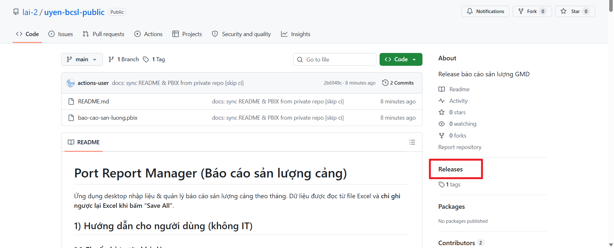
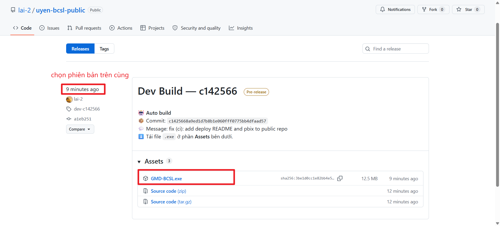
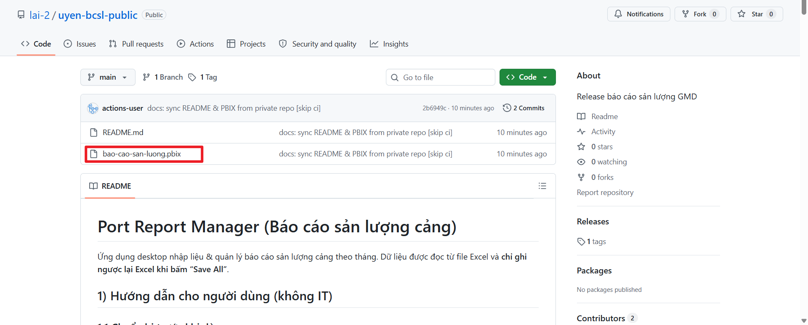
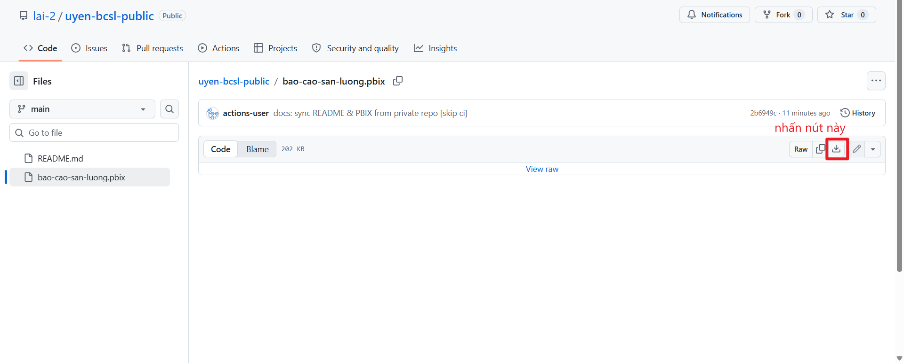
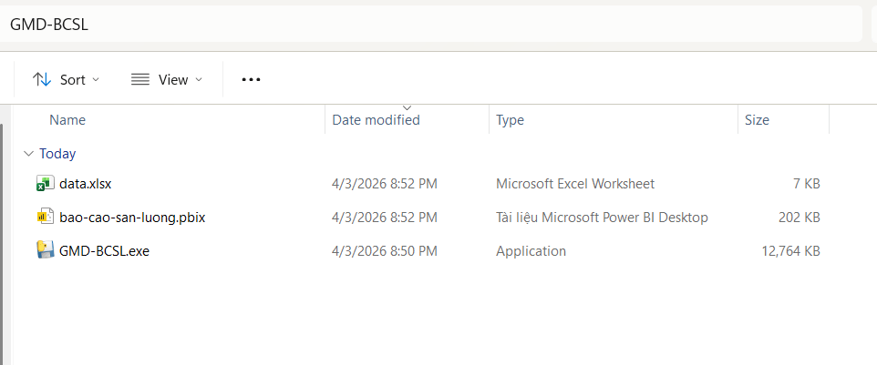

# Port Report Manager (Báo cáo sản lượng cảng)

Ứng dụng desktop nhập liệu & quản lý báo cáo sản lượng cảng theo tháng. Dữ liệu được đọc từ file Excel và **chỉ ghi ngược lại Excel khi bấm “Save All”**.

## 1) Hướng dẫn cho người dùng (không IT)

### 1.1 Tải file về máy

#### Tải file `.exe` (ứng dụng)

1. Truy cập trang **Releases** của repo: [github.com/lai-2/uyen-bcsl-public/releases](https://github.com/lai-2/uyen-bcsl-public/releases)
  
2. Chọn bản mới nhất (trên cùng).
3. Kéo xuống phần **Assets** → bấm vào `GMD-BCSL.exe` để tải về.
  

> **Lưu ý Windows:** Lần đầu chạy file `.exe` có thể xuất hiện cảnh báo SmartScreen — bấm **"More info"** → **"Run anyway"** để tiếp tục.

#### Tải file `.pbix` (báo cáo Power BI)

1. Truy cập trang chính của repo: [github.com/lai-2/uyen-bcsl-public](https://github.com/lai-2/uyen-bcsl-public)
2. Bấm vào file `bao-cao-san-luong.pbix` (hoặc file Power BI muốn tải).
  
3. Bấm nút **"Download raw file"** (biểu tượng tải xuống) để tải về.
  

---

### 1.2 Chuẩn bị trước khi dùng

1. Chuẩn bị 1 thư mục làm việc (ví dụ `GMD-BCSL/`).
2. Đặt các file sau vào **cùng thư mục**:
   - `GMD-BCSL.exe` (file vừa tải ở bước trên).
   - `bao-cao-san-luong.pbix` (file pbix tải ở bước trên).
   - `data.xlsx` (file dữ liệu — nhận từ người quản lý).
   - (Tuỳ chọn) `config.toml` để đổi đường dẫn Excel/log.

   Cấu trúc thư mục mẫu:
   ```
   GMD-BCSL/
   ├── GMD-BCSL.exe
   ├── bao-cao-san-luong.pbix
   ├── data.xlsx
   └── config.toml   ← tuỳ chọn
   ```

   
3. Khuyến nghị: sao lưu `data.xlsx` trước khi nhập liệu.

### 1.3 Mở ứng dụng

- Double-click vào `GMD-BCSL.exe` để chạy.
- Nếu Excel lỗi cấu trúc/sai đường dẫn, ứng dụng sẽ không vào được màn hình chính.

### 1.4 Nguyên tắc “Save”

- Mọi thao tác thêm/sửa/xoá **chưa** ghi vào Excel cho tới khi bấm `Save All`.
- Khi có thay đổi, thanh trên cùng sẽ hiện trạng thái “Unsaved changes”.
- Mỗi tab có nút `↩ Discard All`: bỏ toàn bộ thay đổi chưa lưu của tab đó và tải lại từ Excel.

### 1.5 Các tab và cách dùng

#### A. Tab `Port Reports` (nhập liệu chính)

Bạn sẽ nhập các cột:
- `Port` (cảng) – chọn từ danh sách
- `Reporter` (đơn vị báo cáo) – chọn từ danh sách
- `Report Month` – nhập theo `yyyy-mm` (ví dụ `2026-03`)
- `Actual TEU` – sản lượng thực tế (chỉ nhập số; có thể dùng dấu phẩy ngăn cách như `12,345`)
- `Plan TEU` – chỉ tiêu KPI của công ty cho cảng (có thể để trống; nếu nhập thì phải là số)

Ghi chú:
- `Group` và `Parent Group` là **tự động** (không sửa trực tiếp). Khi đổi `Port` hoặc `Report Month` thì nhóm sẽ cập nhật theo dữ liệu quan hệ có hiệu lực tại thời điểm tháng đó.
- Không cho phép `Report Month` ở tương lai.
- Không cho phép trùng bộ khoá `(Port, Reporter, Report Month)`.

Các nút trên thanh công cụ:
- `+ Add Row`: thêm 1 dòng trống (mặc định tháng = tháng trước).
- `++ Add Multiples` + checkbox **`Cả năm`**: thêm nhanh nhiều dòng. Hoạt động theo 2 chế độ tuỳ checkbox:

  **Checkbox chưa tích** (chế độ thường):
  - Thêm dòng cho **tháng trước**, nguồn báo cáo mặc định là `VPA` (nếu không có thì lấy reporter đầu tiên).
  - Nếu đang lọc theo Parent Group thì chỉ thêm cảng thuộc Parent Group đó; không lọc thì thêm tất cả cảng đang hoạt động.

  **Checkbox đã tích ☑ Cả năm**:
  - Thêm **12 dòng cho mỗi cảng**, tương ứng tháng 1–12 của **năm hiện tại**.
  - Nguồn báo cáo mặc định là reporter có tên chứa `"nội bộ"` (không phân biệt hoa thường); nếu không có thì lấy reporter có độ ưu tiên thấp nhất.
  - Nếu đang lọc theo Parent Group thì chỉ thêm cảng thuộc Parent Group đó; không lọc thì thêm tất cả cảng.

  **Áp dụng cho cả 2 chế độ:**
  - Bản ghi đã tồn tại (trùng `Port + Reporter + Tháng`) sẽ **không bị thêm lại**.
  - Các dòng thêm nhanh có thể có `Actual TEU = 0`; các dòng `Actual TEU <= 0` sẽ **không được ghi** xuống Excel khi bấm `Save All` (cần nhập giá trị > 0 nếu muốn lưu).
- `↩ Discard All`: bỏ thay đổi chưa lưu của tab.
- `Search`: lọc theo chữ (nhấn Enter ở ô Search để chạy lọc).

Bộ lọc:
- Parent Group → Group → Port (lọc dạng “chọn dần”).
- From/To (nhập `yyyy-mm`, nhấn Enter để áp dụng).

#### B. Tab `Groups`

- Quản lý danh sách Group.
- Cột `Region` là tuỳ chọn (chọn 1 group làm region cha).
- `Created At`/`Expired At` chấp nhận định dạng `yyyy-mm-dd` hoặc `yyyy-mm` (để trống `Expired At` nếu chưa hết hiệu lực).

#### C. Tab `Ports`

- Quản lý danh sách Port.
- Cột `Group` là tuỳ chọn (gán port vào group).
- Cột `Province` là tuỳ chọn.
- `Created At`/`Expired At` chấp nhận định dạng `yyyy-mm-dd` hoặc `yyyy-mm`.

### 1.6 Xoá dữ liệu (Delete)

- Chọn 1 dòng trong bảng và bấm `Delete`.
- Dòng sẽ được “đánh dấu xoá” (chưa xoá thật trong Excel) cho tới khi bấm `Save All`.

### 1.7 Phím tắt (tổng hợp từ source code)

**Áp dụng trong tab `Port Reports`:**
- `Ctrl+F`: đưa con trỏ vào ô `Search`.
- `Ctrl+N`: thêm 1 dòng mới.

**Trong bảng `Port Reports` (bảng lớn ở giữa):**
- `Enter`: sửa ô đang chọn (ô chọn bằng mũi tên `Left/Right` hoặc double click).
- `Double click`: sửa đúng ô đang bấm.
- `Tab` / `Shift+Tab`: lưu ô hiện tại và chuyển sang ô kế/trước (chỉ các cột cho phép sửa).
- `Esc`: huỷ sửa ô đang nhập.
- `Delete`: đánh dấu xoá dòng đang chọn.
- `Ctrl+C`: copy dòng đang chọn (lưu vào bộ nhớ tạm của app).
- `Ctrl+V`: paste (tạo 1 dòng mới giống dòng đã copy và chèn xuống ngay dưới dòng đang chọn).
- `Ctrl+D`: Fill down (lấy `Actual TEU` của dòng phía trên xuống dòng hiện tại).
- `Ctrl+Shift+D`: Duplicate (nhân đôi dòng đang chọn và chèn xuống ngay dưới).
- Khi đang sửa ô số (`Actual TEU`, `Plan TEU`): dùng `Up/Down` để lưu ô và nhảy lên/xuống dòng kế tiếp cùng cột.
- `Ctrl+V` khi đang ở cột `Actual TEU` hoặc `Plan TEU`: paste nhiều giá trị cùng lúc xuống các dòng phía dưới (copy từ Excel rồi paste thẳng vào đúng cột cần điền).

**Trong các bảng CRUD (`Groups`, `Ports`):**
- `Enter`: sửa ô đang chọn (cột chọn bằng `Left/Right`).
- `Double click`: sửa đúng ô đang bấm.
- `Tab` / `Shift+Tab`: lưu và chuyển ô kế/trước.
- `Esc`: huỷ sửa ô.
- `Delete`: đánh dấu xoá dòng.
- Khi đang sửa ô số: `Up/Down` để lưu ô và nhảy dòng kế tiếp cùng cột.

## 2) Hướng dẫn cho IT (test / run / build)

### 2.1 Yêu cầu

- Python `>= 3.13`
- Tkinter (Windows thường có sẵn; Linux có thể cần cài gói `python3-tk`)
- Khuyến nghị dùng `uv` để cài dependency và chạy lệnh (repo đã có `uv.lock`)

### 2.2 Cấu hình runtime

File `config.toml` (đặt cùng thư mục chạy app):

```toml
excel_path = "./data.xlsx"
log_path = "./logs/app.log"
```

Nếu không có `config.toml` thì app dùng mặc định như trên.

### 2.3 Cài dependency (dev)

```bash
uv sync --dev
```

### 2.4 Chạy app ở chế độ dev

```bash
uv run python main.py
```

### 2.5 Chạy test

```bash
uv run pytest tests/ -v
```

### 2.6 Build app (đóng gói)

Repo hiện chưa “pin” tool build; cách phổ biến là dùng PyInstaller.

1) Cài PyInstaller (dev):

```bash
uv add --dev pyinstaller
```

2) Build 1-file executable:

```bash
uv run pyinstaller --onefile --noconsole --name uyen-bcsl2 main.py
```

3) Lấy file ở `dist/` và tạo thư mục chạy dạng:
- `uyen-bcsl2(.exe)`
- `data.xlsx`
- `config.toml` (tuỳ chọn)
- thư mục `logs/` (app sẽ tự tạo nếu chưa có)

## 3) Log

Log mặc định ghi tại `./logs/app.log` (hoặc theo `log_path` trong `config.toml`).

## 4) Troubleshooting

- Lỗi `ModuleNotFoundError: tkinter`: cài Tkinter (ví dụ Ubuntu/Debian: `sudo apt install python3-tk`).
- Không thấy dữ liệu: kiểm tra `excel_path` và tên sheet trong `data.xlsx` (phải có: `groups`, `ports`, `reporters`, `relationship`, `port_reports`, `provinces`).

**Linux: Lỗi `cannot open display` hoặc không hiển thị cửa sổ**
- Đảm bảo đang chạy trong môi trường desktop (X11/Wayland), không phải SSH thuần.
- Nếu qua SSH: dùng `ssh -X` hoặc `-Y`.

**Linux: Lỗi thiếu thư viện `libgtk-3`**
- Chạy lại lệnh cài thư viện hệ thống ở trên.

**Windows: Lỗi `LINK : fatal error` khi build**
- Cài **Visual Studio C++ Build Tools** và chọn workload "Desktop development with C++".

**File Excel không tải được**
- Kiểm tra `excel_path` trong `config.toml` trỏ đúng đến file.
- Đảm bảo file không đang được mở bởi Excel.
